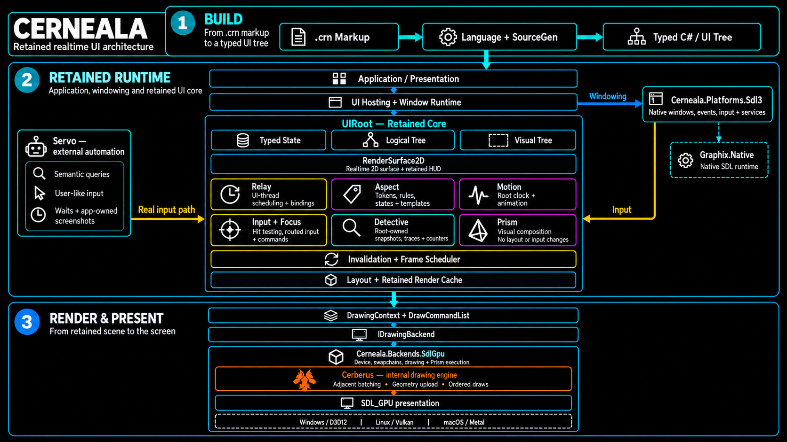

# Cerneala Architecture

This document describes the architecture that exists in the repository now.
It explains ownership and flow. It is not a complete API reference and it is
not a promise that every WPF-shaped type has matching WPF behavior.

The canonical public API documentation lives under
[`docs-site/documentation/classes/`](docs-site/documentation/classes/).



## The Short Version

Cerneala is a retained realtime UI framework.

The application creates a UI tree and mutates typed state. Cerneala tracks the
resulting invalidation, processes explicit frame phases, retains layout and
drawing work, and submits backend-independent commands to a selected renderer.

Traditional UI and game rendering are not separate products glued together.
`RenderSurface2D` is a `ContentControl`, so a realtime game view and its normal
retained HUD can live in the same UI tree.

## End-To-End Flow

```text
Build time

.crn markup
    -> Cerneala.Language syntax and semantics
    -> Cerneala.SourceGen
    -> typed C# application and UI tree

Runtime

Application / presentation
    -> window hosting and platform runtime
    -> UIRoot retained state and trees
    -> invalidation and frame scheduler
    -> layout and retained render cache
    -> DrawingContext and DrawCommandList
    -> IDrawingBackend
    -> WindowsDX, MonoGame, or SDL3 GPU presentation
```

The build-time language stack and the runtime UI stack are deliberately
separate. `Cerneala.Language` is not a runtime dependency of `Cerneala.UI`.

## Build-Time Authoring

### `.crn`

`.crn` is Cerneala's constrained compile-time markup language. It resembles XML
because UI trees are naturally hierarchical. It is not general XAML and is not
loaded dynamically at runtime.

The language layer owns:

- lossless syntax and source spans;
- recovery for incomplete editor input;
- semantic symbols and type-aware validation;
- diagnostics, completion, navigation, structure, and formatting;
- the shared rules used by the source generator and language server.

The source generator owns lowering validated markup into typed C#. Generated
applications can select a startup window, initialize resources, and emit the
process entry point. Generated `Window` and `UserControl` types pair with normal
C# partial classes.

Code-first construction remains valid. Markup is an authoring layer over the
same runtime controls and typed properties.

## Application And Window Hosting

`Application` owns process-level lifecycle, services, resources, window
tracking, and shutdown policy. Generated `App.crn` declarations connect that
application model to a concrete startup window.

`WindowApplicationRuntime` owns the frame and native window lifecycle for the
desktop application. Platform projects provide native windows, input sources,
cursor behavior, clipboard and related services. Graphics backends provide the
drawing session used by each presented window.

Backend selection is explicit through `ApplicationBackendAttribute`. It is not
inferred from whichever backend assembly happened to load first.

## `UIRoot` And Retained Ownership

Each root owns the retained systems for one UI tree:

- typed property state;
- logical and visual relationships;
- Relay scheduling;
- inherited-property propagation;
- Aspect resolution;
- Motion state and the root clock;
- invalidation queues and frame scheduling;
- layout;
- retained rendering;
- hit testing, routed input, focus, capture, and commands;
- resources and Detective diagnostics.

This ownership matters. These systems are coordinated at the root instead of
running as unrelated global managers.

## Typed State

`UiObject` stores values through typed `UiProperty<T>` descriptors. Property
metadata defines validation, coercion, equality, inheritance, and the retained
work affected by a change.

The effective value model distinguishes sources such as defaults, inherited
values, Aspect values, animation, and local values. A no-op assignment must not
enqueue work. A render-only property change must not silently become a layout
pass.

The property system exists to drive explicit retained behavior. It is not a
compatibility clone of WPF dependency properties.

## Logical And Visual Trees

Cerneala keeps logical and visual relationships separate.

The logical tree represents application ownership, content, resources,
commands, and semantic relationships.

The visual tree represents layout, rendering order, clipping, hit testing, and
generated template content.

A control can therefore own application content logically while Aspect and
templates generate a different visual subtree. Tree mutation is validated,
reparenting is explicit, and attach/detach lifecycle follows root ownership.

## Relay

Each root owns a `UiRelay`. Relay moves scheduled callbacks and binding refresh
work to the UI thread owned by that root.

Relay does not make arbitrary application state thread-safe. Worker code posts
the complete UI mutation. The root drains a stable snapshot during the frame
pipeline, so callbacks added during that drain do not create an unbounded loop.

## Input, Focus, And Commands

Platform input sources produce backend-neutral frame snapshots. Cerneala maps
those snapshots into the retained tree through hit testing and routed events.

The input layer owns:

- pointer, keyboard, text, touch, and stylus frame contracts where implemented;
- hit-test filtering and retained hit-test data;
- tunnel, direct, and bubble routes;
- pointer capture and hover state;
- keyboard focus and navigation;
- gestures and manipulation primitives;
- input bindings, commands, and command routing.

The component that receives an event, the element that triggered input, and the
element that owns a command can be different. The route is derived from the
retained element relationships, not from a parallel application tree.

## Invalidation And Frame Scheduling

State changes do not immediately recompute the whole UI. They enqueue the work
owned by the affected invariant.

The scheduler coordinates phases such as:

```text
Relay
    -> inherited properties
    -> Aspect
    -> Motion and time-sensitive invalidation
    -> measure
    -> arrange
    -> render-cache rebuild
    -> hit-test refresh
    -> cached root command publication
```

Input is integrated with this flow so that it sees current retained bounds and
its state changes can be committed before presentation.

The exact processor order is a runtime contract covered by tests. The important
invariants are:

- unchanged trees do not remeasure;
- unchanged trees do not rearrange;
- unchanged local visuals do not regenerate drawing commands;
- render-only changes do not force layout;
- failed work does not silently clear its dirty state;
- draw submission does not mutate or rebuild retained UI state.

## Layout

Layout owns measure and arrange. It uses layout-specific geometry such as
`LayoutSize`, `LayoutPoint`, and `LayoutRect` rather than pretending drawing
coordinates and layout constraints have identical semantics.

Panels and controls cache layout results against the relevant constraints and
versions. Layout invalidation propagates through explicit boundaries. Visibility
policy determines whether an element participates in layout, rendering, input,
and focus.

## Aspect

Aspect owns styling and control composition.

The current runtime uses one canonical model for rules originating from code,
markup, resources, inline declarations, and `ElementAspect`. Resolution covers
tokens, target types, variants, states, data, resources, templates, and
sidecars. Winning values are applied through the typed property system with
explicit source precedence.

Aspect does not own time sampling or GPU filters. Those belong to Motion and
Prism.

## Motion

Motion owns animation under the root clock. It includes typed motion values,
specifications, graphs, composition, transactions, presence, layout motion,
scroll and gesture bindings, and property animation.

Motion writes through the animated property source. The invalidation category
of the animated property decides whether a sample affects layout, rendering, or
another retained phase. Rendering does not get to invent animation state.

## Retained Rendering

Controls record local drawing commands through `RenderContext` and
`DrawingContext`. `ElementRenderCache` retains local work. The retained renderer
combines valid local caches into a root command list in visual order.

```text
Control.OnRender
    -> local DrawCommandList
    -> ElementRenderCache
    -> retained root command list
    -> IDrawingBackend.Render(...)
```

The backend may present every frame. That does not authorize it to call
`OnRender`, rerun layout, or mutate the UI tree during submission.

## `RenderSurface2D`

`RenderSurface2D` is the first-class realtime 2D surface inside the control
model. It inherits `ContentControl` and participates in normal layout,
invalidation, attachment, detachment, resources, and rendering order.

The control records a specialized 2D command stream through
`RenderSurface2DFrame`. Its retained `Content` is rendered above the game
surface, which allows ordinary controls to form the HUD or overlay.

Continuous mode evaluates drawing each Cerneala frame. On-demand mode retains
the previous surface until layout, a tracked drawable dependency, a relevant
property, or `InvalidateFrame()` marks it dirty.

Graphics-device resources and surface sessions belong to the backend and are
disposed when the control detaches.

## Drawing Boundary

The `Drawing` layer is backend-neutral command recording, not another UI tree.

- `DrawingContext` records intent.
- `DrawCommandList` stores ordered commands.
- `DrawCommand` carries validated command payloads.
- `IDrawingBackend` consumes the commands.
- text and image services prepare backend-neutral resources and descriptors.

Drawing does not own layout, input, control state, Aspect, Motion, or tree
lifecycle. Controls do not call SDL, MonoGame, Skia, HarfBuzz, `SpriteBatch`, or
native GPU APIs directly.

## Prism

Prism owns retained local visual composition. Its definitions describe layers,
filters, styles, masks, blend operations, parameters, and resources. A
`PrismInstance` attaches that definition to a visual and tracks live state.

Prism can consume a rendered visual result or backdrop and produce composed
pixels. It does not change layout, hit testing, focus, or the logical tree.

Backend executors own GPU resources, shader execution, and retained Prism result
caches. The shared catalog and source generator keep operation names,
parameters, shader artifacts, runtime state, tests, and documentation aligned.

## Backend Boundary

The current repository contains three presentation paths:

- WindowsDX;
- MonoGame and `SpriteBatch`;
- SDL3 GPU on native desktop platforms.

SDL3 GPU is the strategic backend going forward. MonoGame remains an existing
compatibility and transition path, but it is planned for gradual retirement.
No removal version or date is currently committed.

The SDL3 path separates native platform ownership from GPU drawing ownership:

- `Cerneala.Platforms.Sdl3` owns SDL windowing, events, input, and native
  services;
- `Cerneala.Backends.SdlGpu` owns the graphics device, swapchain sessions,
  drawing resources, Prism execution, and presentation;
- Cerberus owns the GPU-oriented drawing compilation and execution path inside
  the SDL3 backend.

Core UI code remains unaware of the selected native backend.

## Detective And Evidence

Cerneala treats runtime behavior as something to measure, not something to
guess about. `UIRoot.Detective` is the public owner for runtime snapshots,
traces, and counters covering invalidation, layout, render caches, routed input,
Motion, Aspect, resources, platform services, and frame work. The functional
domains still produce the evidence; Detective exposes it without taking over
their runtime invariants. Backend-specific Prism evidence remains produced at
the backend boundary.

Applicable changes are verified through combinations of:

- unit and contract tests;
- deterministic host tests;
- native runtime smokes;
- screenshots produced by `Window.SaveScreenshot`;
- golden images and pixel or color diffs;
- performance counters and BenchmarkDotNet results;
- API diffs and canonical documentation checks.

A green focused test proves only its focused contract. Backend or retained
runtime changes still require their wider conformance gates.

## Architecture Rules

- Fix the layer that owns the violated invariant.
- Do not patch a visible control when the scheduler, layout, input, or backend
  owns the contract.
- Do not create parallel state, input, tree, or rendering paths for convenience.
- Do not make `DrawCommandList` a scene graph.
- Do not make drawing own UI state.
- Do not let backend-specific types leak into the retained core.
- Do not claim backend parity from compilation alone.
- Do not update golden images until the intended visual contract is known.
- Do not expand WPF-compatible surface merely because a familiar name exists.
- Keep public API documentation synchronized with implementation and tests.

## Related Documents

- [Getting Started](docs/getting-started.md)
- [Cerneala Markup Guide](docs/CernealaMarkupGuide.md)
- [Roadmap](ROADMAP.md)
- [SDL desktop backend](docs/sdl-desktop-backend.md)
- [Prism Guide](docs/prism-guide.md)
- [Cerneala website](https://chevalier12.github.io/Cerneala/)
- [Discord](https://discord.gg/p6SbqByd59)
